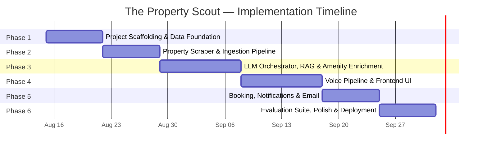

# The Property Scout — Phase-Wise Implementation Plan

> **Derived from:** [architecture.md](file:///c:/Users/Ritk%20Gaur/Desktop/The%20Property%20Scout/Docs/architecture.md) · [context.md](file:///c:/Users/Ritk%20Gaur/Desktop/The%20Property%20Scout/Docs/context.md)
> **Last Updated:** 2026-08-14

---

## Plan Overview

The project is broken into **6 phases**, ordered by dependency chain. Each phase produces a **working, testable increment** — nothing is built in isolation.



| Phase | Focus | Estimated Duration | Key Output |
|---|---|---|---|
| **1** | Project scaffolding, DB schema, dev environment | ~1 week | Running backend + DB + empty frontend |
| **2** | Property scraper + GitHub Actions pipeline | ~1 week | Live data flowing into PostgreSQL daily |
| **3** | LLM orchestration, RAG pipeline, amenity enrichment | ~1.5 weeks | Text-based conversation with enriched results |
| **4** | Voice processing + frontend UI | ~1.5 weeks | Full voice bot with split-pane property UI |
| **5** | Booking system, N8N notifications, email | ~1 week | End-to-end booking + email flow |
| **6** | Eval suite, golden dataset, deployment, polish | ~1 week | Production-ready, evaluated system |

---

## Phase 1: Project Scaffolding & Data Foundation

> **Goal:** Set up the monorepo, provision databases, create all DB schemas, and establish the development workflow.

### 1.1 Tasks

| # | Task | Files / Artifacts | Details |
|---|---|---|---|
| 1.1 | Initialize monorepo structure | Root `package.json`, `.gitignore`, `README.md` | Follow the directory structure from [architecture.md §16](file:///c:/Users/Ritk%20Gaur/Desktop/The%20Property%20Scout/Docs/architecture.md) |
| 1.2 | Scaffold FastAPI backend | `backend/api/app.py`, `backend/config.py`, `backend/requirements.txt` | FastAPI with uvicorn, CORS middleware, health check endpoint |
| 1.3 | Scaffold React + Vite frontend | `frontend/` via `npx create-vite` | TypeScript template, basic dev server |
| 1.4 | Set up PostgreSQL | `docker-compose.yml`, `backend/db/connection.py` | PostgreSQL container for local dev |
| 1.5 | Create DB migrations & models | `backend/db/models.py`, `backend/db/migrations/` | **Properties**, **Amenities**, **Bookings**, **Sessions** tables (schemas from [architecture.md §3](file:///c:/Users/Ritk%20Gaur/Desktop/The%20Property%20Scout/Docs/architecture.md)) |
| 1.6 | Set up Vector DB | `docker-compose.yml` (Qdrant container) | Local Qdrant instance for neighborhood chunks |
| 1.7 | Create `.env.example` | `.env.example` | All env vars from [architecture.md §14.2](file:///c:/Users/Ritk%20Gaur/Desktop/The%20Property%20Scout/Docs/architecture.md) |
| 1.8 | Wire up basic API routes (stubs) | `backend/api/routes/session.py`, `properties.py`, `bookings.py`, `notifications.py` | Return placeholder responses; validates project wiring |
| 1.9 | Dockerize backend | `backend/Dockerfile` | Multi-stage build for FastAPI |

### 1.2 Acceptance Criteria

- [ ] `docker-compose up` starts PostgreSQL + Qdrant + FastAPI backend
- [ ] `GET /api/health` returns `200 OK`
- [ ] All 4 DB tables created via migration
- [ ] `npm run dev` in `frontend/` starts Vite dev server
- [ ] Stub API routes respond with correct status codes

### 1.3 Key Decisions to Lock In

| Decision | Recommendation | Rationale |
|---|---|---|
| ORM | SQLAlchemy 2.0 + Alembic | Async support, mature migration tooling |
| Pydantic version | v2 | Native FastAPI integration, better performance |
| Python version | 3.12+ | Latest stable, best asyncio performance |
| Node version | 20 LTS | Long-term support, stable |

---

## Phase 2: Property Scraper & Ingestion Pipeline

> **Goal:** Build the daily scraper for bengaluru.rent, including PII scrubbing, normalization, geocoding, and the GitHub Actions workflow.

### 2.1 Tasks

| # | Task | Files / Artifacts | Details |
|---|---|---|---|
| 2.1 | Analyze bengaluru.rent page structure | *(research)* | Identify HTML selectors for each data field, pagination pattern, listing URLs |
| 2.2 | Build HTML parser + data extractor | `scraper/parser.py` | Extract all fields defined in [context.md §2.2](file:///c:/Users/Ritk%20Gaur/Desktop/The%20Property%20Scout/Docs/context.md): accommodation type, rent, rooms, move-in time, gender, parking, food/smoking pref, address |
| 2.3 | Build PII scrubber | `scraper/pii_scrubber.py` | Regex patterns for phone numbers, emails, names. NER fallback using spaCy `en_core_web_sm` for edge cases. Log detection counts (not PII itself) |
| 2.4 | Build data normalizer | `scraper/normalizer.py` | Standardize rent (strings → integers), rooms ("2 BHK" → `2`), enums for accommodation_type, gender, food/smoking pref |
| 2.5 | Build geocoder | `scraper/geocoder.py` | Extract lat/lng from property address using Nominatim (free, no API key). Rate-limit to 1 req/sec |
| 2.6 | Build upsert logic | `scraper/main.py` | Insert new → Update changed → Mark missing as `status='unavailable'`. Use `source_id` as dedup key |
| 2.7 | Implement "Not for rent" filter | `scraper/parser.py` | Skip listings marked "Not for rent" or flagged for transparency |
| 2.8 | Create GitHub Actions workflow | `.github/workflows/daily-scraper.yml` | Cron `30 0 * * *` (06:00 IST), manual dispatch, secrets for `DATABASE_URL` |
| 2.9 | Write scraper tests | `scraper/tests/` | Unit tests with sample HTML fixtures, PII scrubbing edge cases |

### 2.2 Acceptance Criteria

- [ ] Scraper successfully parses live bengaluru.rent pages
- [ ] PII scrubber removes all owner/agent details (verified against 20+ sample listings)
- [ ] All required property fields are captured and normalized
- [ ] Geocoding produces valid lat/lng for ≥90% of addresses
- [ ] "Not for rent" listings are excluded
- [ ] Upsert logic correctly handles new/updated/removed listings
- [ ] GitHub Actions workflow runs successfully on manual dispatch
- [ ] Unit tests pass with >80% coverage on scraper module

### 2.3 Dependencies

- Phase 1 complete (PostgreSQL + models available)
- Network access to bengaluru.rent

### 2.4 Risks & Mitigations

| Risk | Impact | Mitigation |
|---|---|---|
| bengaluru.rent changes HTML structure | Scraper breaks | Use resilient selectors; add scraper health alerts via GH Actions |
| Rate limiting by bengaluru.rent | Incomplete data | Implement polite delays (2-3s between requests), User-Agent header |
| Geocoding failures | Missing lat/lng | Fallback: locality-level centroid coordinates from a static mapping |

---

## Phase 3: LLM Orchestrator, RAG & Amenity Enrichment

> **Goal:** Build the core intelligence layer — LLM conversation engine, RAG pipeline for neighborhood data, and OpenStreetMap MCP amenity enrichment. Everything works via text (voice comes in Phase 4).

### 3.1 Tasks — LLM Orchestrator

| # | Task | Files / Artifacts | Details |
|---|---|---|---|
| 3.1 | Build LLM orchestrator | `backend/llm/orchestrator.py` | Manages conversation turns, calls tools, constructs prompts, returns structured responses |
| 3.2 | Define system prompts | `backend/llm/prompts.py` | Greeting prompt, preference collection prompt, shortlist presentation prompt, refinement prompt. Each must instruct grounded reasoning |
| 3.3 | Implement state manager | `backend/llm/state_manager.py` | `UserPreferences` TypedDict, state update rules from [architecture.md §9.3](file:///c:/Users/Ritk%20Gaur/Desktop/The%20Property%20Scout/Docs/architecture.md): parse → apply targeted changes → preserve untouched keys → re-query → diff shortlist |
| 3.4 | Define LLM tools | `backend/llm/tools.py` | Tool definitions for: `search_properties`, `get_amenities`, `get_neighborhood_info`, `book_visit`, `send_shortlist_email` |
| 3.5 | Implement property search query builder | `backend/db/queries.py` | Translate `UserPreferences` → SQL WHERE clauses. **[NEW]** Fallback mechanism: if hard filters yield 0 results, query what is actually available and return a strict `warning` flag to the AI to prevent hallucinated suggestions. |
| 3.6 | Wire session API routes | `backend/api/routes/session.py` | `POST /api/session` (create), `GET /api/session/:id` (retrieve), `POST /api/session/:id/message` (process message) |

### 3.2 Tasks — RAG Pipeline

| # | Task | Files / Artifacts | Details |
|---|---|---|---|
| 3.7 | Build neighborhood web crawler | `rag_ingestion/crawler.py` | Crawl Reddit (r/bangalore), blrexplorer, local blogs/news. Respect robots.txt. Output: raw text per page |
| 3.8 | Define source list | `rag_ingestion/sources.json` | Curated list of URLs: Reddit threads, blog posts, news articles about Bengaluru neighborhoods |
| 3.9 | Build text chunker | `rag_ingestion/chunker.py` | ~500 tokens/chunk, 50-token overlap. Tag with `locality`, `theme` (safety/daily_life/transport/culture), `source_url`, `source_type` |
| 3.10 | Build embedder | `rag_ingestion/embedder.py` | Use **BGE-large** (`BAAI/bge-large-en-v1.5`, 1024 dims) via `sentence-transformers`. Free, runs locally. Batch process chunks |
| 3.11 | Build Vector DB upserter | `rag_ingestion/upserter.py` | Upsert to Qdrant with dedup by `source_url + chunk_offset`. Include metadata filters |
| 3.12 | Build RAG retriever | `backend/rag/retriever.py` | Semantic search: query → top-K chunks filtered by `locality`. K=10 |
| 3.13 | Build reranker | `backend/rag/reranker.py` | Score by relevance + recency, select top 5 |
| 3.14 | Build cited synthesizer | `backend/rag/synthesizer.py` | Feed chunks to LLM with citation instructions. Output: claims + source URLs + confidence. Handle empty context with explicit uncertainty |

### 3.3 Tasks — Amenity Enrichment

| # | Task | Files / Artifacts | Details |
|---|---|---|---|
| 3.15 | Build OSM MCP client | `backend/mcp/osm_client.py` | Query OpenStreetMap MCP with lat/lng + radius (2km default). Parse response into structured amenities |
| 3.16 | Build amenity category mapper | `backend/mcp/amenity_mapper.py` | OSM tag → category mapping from [architecture.md](file:///c:/Users/Ritk%20Gaur/Desktop/The%20Property%20Scout/Docs/architecture.md) |
| 3.17 | Implement on-demand enrichment with caching | `backend/mcp/osm_client.py` | Enrich when property is first shortlisted. Cache in amenities table. Re-fetch if `fetched_at > 7 days` |
| 3.18 | Build distance calculator | `backend/mcp/osm_client.py` | Haversine formula: straight-line distance from property to each amenity |

### 3.4 Acceptance Criteria

- [ ] Text-based conversation collects preferences and returns matching properties
- [ ] State manager correctly preserves untouched keys during edits (unit tested with 10+ scenarios)
- [ ] Properties are enriched with nearby amenities from OpenStreetMap MCP
- [ ] RAG pipeline returns cited neighborhood insights for at least 10 major Bengaluru localities
- [ ] Bot says "I don't have information on this" when no RAG data exists for a locality
- [ ] `POST /api/session/:id/message` returns full response with shortlist, amenities, neighborhood data, reasoning, and sources
- [ ] Each recommendation includes grounded reasoning (not generic)

### 3.5 Dependencies

- Phase 2 complete (property data in DB)
- LLM API key (OpenAI / Anthropic)
- OpenStreetMap MCP server accessible

### 3.6 Risks & Mitigations

| Risk | Impact | Mitigation |
|---|---|---|
| LLM hallucinates property details | Bad user experience | Strict tool-calling mode; LLM never generates property data from memory |
| Thin RAG coverage for some neighborhoods | Missing guidance | Explicit uncertainty handling; expand source list iteratively |
| MCP server latency | Slow enrichment | Cache aggressively; enrich in background after initial shortlist is shown |
| State manager drops keys | Failed evals | Deep unit test coverage with multi-turn edit edge cases |

---

## Phase 4: Voice Pipeline & Frontend UI

> **Goal:** Add the voice interface (STT/TTS) and build the full frontend with split-pane layout, property cards, filters, and real-time transcript.

### 4.1 Tasks — Voice Processing (Ultra-Low Latency Pipeline)

To achieve a TTFT (Time to First Audio Token) of **< 700ms**, handle interruptions, and maintain strict guardrails, we will build a tightly integrated streaming pipeline.

| # | Task | Files / Artifacts | Details |
|---|---|---|---|
| 4.1 | Integrate Streaming STT | `backend/voice/stt.py` | Deepgram SDK via WebSocket. Enable `endpointing=300ms` for fast silence detection, `interim_results=true`, and `diarize=true` for speaker diarization. |
| 4.2 | Integrate Streaming TTS | `backend/voice/tts.py` | `edge-tts` (Microsoft Edge TTS). This is 100% free, unlimited, and offers high-quality neural voices. We will stream text from Groq directly into `edge-tts`, which supports asynchronous streaming audio chunks to hit low latency. |
| 4.3 | Bidirectional WebSocket Manager | `backend/voice/streaming.py` | Handles WebRTC/WebSocket audio. Must support **Barge-in (Interruptions)**: If the user speaks while the bot is talking, the WebSocket immediately halts the TTS audio stream and resets the LLM context. |
| 4.4 | Implement Client-Side VAD | Frontend `VoiceControls` | Use `@ricky0123/vad-react` (Silero VAD) in React. Evaluates 20ms audio chunks directly in browser. Prevents cutoff sentences and detects turn-taking natively. |
| 4.5 | LLM Optimization & Guardrails | `backend/llm/orchestrator.py` | 1. **Streaming**: `stream=True` in Groq. 2. **Fast Non-Reasoning Model**: Use `openai/gpt-oss-20b` to achieve instant TTFT without 5-second `<think>` block delays. 3. **Strict Guardrails**: Discard all reasoning tags if emitted. |

### 4.2 Tasks — Frontend UI

> Detailed UX flows and wireframes: [ux_design.md](file:///c:/Users/Ritk%20Gaur/Desktop/The%20Property%20Scout/Docs/ux_design.md)

| # | Task | Files / Artifacts | Details |
|---|---|---|---|
| 4.6 | Design system & global styles | `frontend/src/styles/` | Color palette, typography (Inter/Outfit from Google Fonts), spacing, dark mode, glassmorphism |
| 4.7 | Build Header component | `frontend/src/components/Header/` | Branding, logo, dark mode toggle |
| 4.8 | Build Landing Page | `frontend/src/components/LandingPage/` | **[NEW]** Welcome hero, `🔍 Find a Property` + `📅 Manage Booking` quick actions, popular search chips (see [ux_design.md §2](file:///c:/Users/Ritk%20Gaur/Desktop/The%20Property%20Scout/Docs/ux_design.md)) |
| 4.9 | Build ConversationPane | `frontend/src/components/ConversationPane/` | TranscriptList (auto-scroll, user/bot styling), TextInput, VoiceControls (MicButton + AudioVisualizer), Quick Action Chips above input |
| 4.10 | Build PropertyPane | `frontend/src/components/PropertyPane/` | Rendered only after shortlist generated. Floating property count badge |
| 4.11 | Build FilterBar | `frontend/src/components/PropertyPane/FilterBar/` | Budget range, BHK selector, locality dropdown, custom filter chips (removable) |
| 4.12 | Build PropertyCard | `frontend/src/components/PropertyPane/PropertyCard/` | All fields: rent, rooms, accommodation type, address, AI reasoning, amenities grid, neighborhood insights, collapsible sources/references, action buttons (Book Visit / Mail). "Data unavailable" badge for missing info |
| 4.13 | Build Compare Properties view | `frontend/src/components/PropertyPane/CompareView/` | **[NEW]** Select 2-3 cards → side-by-side comparison table (rent, BHK, amenities, neighborhood) |
| 4.14 | Build BookingModal | `frontend/src/components/BookingModal/` | **[NEW]** 4-step flow: Date picker → Time slot selector (greyed-out booked slots) → Email input → Confirmation with Booking ID (see [ux_design.md §5](file:///c:/Users/Ritk%20Gaur/Desktop/The%20Property%20Scout/Docs/ux_design.md)) |
| 4.15 | Build ManageBookingModal | `frontend/src/components/ManageBookingModal/` | **[NEW]** Booking ID lookup → Show details → Reschedule / Cancel actions (see [ux_design.md §6](file:///c:/Users/Ritk%20Gaur/Desktop/The%20Property%20Scout/Docs/ux_design.md)) |
| 4.16 | Implement layout transition animation | `frontend/src/App.tsx` | Full-width → split-pane when shortlist appears. Smooth CSS transition |
| 4.17 | Build API service layer | `frontend/src/services/` | REST client for session, properties, bookings. WebSocket manager for streaming |
| 4.18 | Build custom hooks | `frontend/src/hooks/` | `useSession`, `useVoice`, `useShortlist`, `useFilters`, `useBooking` |
| 4.19 | Build TypeScript interfaces | `frontend/src/types/` | Match backend Pydantic models: `Property`, `Amenity`, `Booking`, `Session`, `UserPreferences` |
| 4.20 | Session persistence via localStorage | `frontend/src/services/sessionStorage.ts` | **[NEW]** Store session ID in `localStorage`. On return visit, auto-detect and resume previous conversation/preferences |
| 4.21 | Responsive layout | All components | Desktop-first split-pane; mobile uses tabbed view (Conversation tab / Shortlist tab) |
| 4.22 | Soft vs Hard Filter UI Sync | `hooks/useConversation.ts`, `App.tsx` | **[NEW]** Use `hasPerformedSearch` boolean flag to keep split-pane open when a search returns 0 properties, allowing empty states to display without vanishing the PropertyPane |

### 4.3 Acceptance Criteria

- [ ] User can speak into microphone and receive voice + text responses
- [ ] Transcript shows all messages in real time with distinct user/bot styling
- [ ] Layout smoothly transitions from full-width to split-pane when shortlist appears
- [ ] Property cards display all enriched data including amenities, neighborhood insights, and source citations
- [ ] Missing data shows "Data unavailable" badge instead of blank or fabricated content
- [ ] Filters modify the shortlist in real time (budget slider, BHK buttons, filter chips)
- [ ] Filter changes via UI sync with conversation state (and vice versa)
- [ ] End-to-end voice latency is <3 seconds

### 4.4 Dependencies

- Phase 3 complete (LLM + RAG + API working via text)
- STT API key (Deepgram)
- No TTS API key needed (using free `edge-tts`)

### 4.5 Risks & Mitigations

| Risk | Impact | Mitigation |
|---|---|---|
| High voice latency | Poor UX | Stream TTS audio as chunks arrive (don't wait for full response) |
| Browser microphone permissions | Feature blocked | Clear permission prompt UX; fallback to text-only mode |
| STT accuracy for Indian English | Misunderstood preferences | Show transcript live so user can correct; add text input fallback |
| WebSocket disconnections | Lost conversation | Auto-reconnect with session state recovery from DB |

---

## Phase 5: Booking System, Notifications & Email

> **Goal:** Implement the full booking lifecycle (book / reschedule / cancel) with concurrency safety, and wire up N8N email notifications.

### 5.1 Tasks — Booking System

| # | Task | Files / Artifacts | Details |
|---|---|---|---|
| 5.1 | Build Booking ID & User ID generators | `backend/booking/id_generator.py` | `BK-` + 6 alphanumeric (booking), `USR-` + 6 alphanumeric (user). Collision check against DB |
| 5.2 | Build booking service | `backend/booking/service.py` | CRUD operations: create, get, reschedule (update date/time), cancel (update status) |
| 5.3 | Implement concurrency control | `backend/booking/concurrency.py` | `SELECT ... FOR UPDATE` within transaction. `UNIQUE (property_id, visit_date, visit_time)` constraint. On conflict: suggest alternative slots |
| 5.4 | Wire booking API routes | `backend/api/routes/bookings.py` | `POST /api/bookings` → create, `GET /api/bookings/:booking_id` → get, `PATCH /api/bookings/:booking_id` → reschedule, `DELETE /api/bookings/:booking_id` → cancel |
| 5.5 | Add booking tool to LLM | `backend/llm/tools.py` | `book_visit` tool that the LLM can invoke during conversation. Collects property_id, date, time, email from user |
| 5.6 | Build BookingModal frontend | `frontend/src/components/BookingModal/` | DateTimePicker, EmailInput, ConfirmationView with booking ID display |

### 5.2 Tasks — Notification System

| # | Task | Files / Artifacts | Details |
|---|---|---|---|
| 5.7 | Build webhook payload builders | `backend/notification/payloads.py` | 4 payload types: booking_created, booking_rescheduled, booking_cancelled, shortlist_mailed (schemas from [architecture.md §11.2](file:///c:/Users/Ritk%20Gaur/Desktop/The%20Property%20Scout/Docs/architecture.md)) |
| 5.8 | Build N8N webhook trigger | `backend/notification/webhook.py` | HTTP POST to N8N webhook URL with appropriate payload. Retry logic (3 attempts, exponential backoff) |
| 5.9 | Create N8N workflow — Booking events | N8N dashboard | Webhook → Event router → Email template → SMTP send. Templates for confirmed/rescheduled/cancelled |
| 5.10 | Create N8N workflow — Shortlist email | N8N dashboard | Webhook → Build rich HTML email with property cards → SMTP send |
| 5.11 | Configure sender email | N8N SMTP settings | Dedicated sender address (e.g. `noreply@thepropertyscout.in`). Descriptive subject lines per event type |
| 5.12 | Wire notification API route | `backend/api/routes/notifications.py` | `POST /api/notify/shortlist` → trigger shortlist email |
| 5.13 | Add "Mail shortlist" button to frontend | `frontend/src/components/PropertyPane/ShortlistActions/` | Email input prompt → sends to backend → triggers N8N |

### 5.3 Acceptance Criteria

- [ ] User can book a visit via voice command or UI button
- [ ] Booking returns a unique `booking_id` and `user_id`
- [ ] Concurrent bookings for the same slot: one succeeds, other gets alternative suggestions
- [ ] Reschedule updates date/time while preserving booking_id
- [ ] Cancel changes status to `cancelled`
- [ ] Booking confirmation email arrives in user's inbox within 30 seconds
- [ ] Reschedule and cancel emails arrive with correct before/after details
- [ ] "Mail shortlist" sends full enriched property list to user's email
- [ ] All emails have descriptive subject lines and contextual body

### 5.4 Dependencies

- Phase 4 complete (frontend + voice working)
- N8N instance (cloud or self-hosted)
- SMTP credentials (e.g. Gmail app password, SendGrid, or custom domain)

### 5.5 Risks & Mitigations

| Risk | Impact | Mitigation |
|---|---|---|
| Email delivery to spam | User misses confirmation | Use authenticated SMTP (SPF/DKIM), professional sender domain |
| N8N webhook timeout | Lost notification | Retry logic with exponential backoff; dead-letter queue for failed webhooks |
| Race condition edge cases | Double booking | Belt-and-suspenders: transaction locking + unique constraint |

---

## Phase 5.5: RAG Data Ingestion (The Big Crawl)

> **Goal:** Populate the Vector Database with ultra-realistic, boots-on-the-ground neighborhood data before running evaluations, focusing heavily on safety, noise, transit, and culture.

### 5.5.1 Tasks — Data Generation & Pipeline Execution

| # | Task | Files / Artifacts | Details |
|---|---|---|---|
| 5.5.1 | Expand Sources | `rag_ingestion/sources.json` | Add targeted civic sources like Citizen Matters and localized Reddit mega-threads. |
| 5.5.2 | Implement Recursive Chunking | `rag_ingestion/chunker.py` | Upgrade from fixed-word sliding window to **Recursive Semantic Chunking** (splitting by paragraphs, then sentences) to maintain contextual coherence. Ensure tags map strictly to: `safety`, `daily_life`, `transport`, `culture`. |
| 5.5.3 | Build Reddit Mock Injector | `rag_ingestion/inject_reddit_data.py` | To bypass Reddit's strict anti-bot `429/403` blocks, build a script that procedurally generates and injects highly realistic Reddit-style neighborhood complaints/reviews (covering water logging, crime, commute times) directly into the processing pipeline. |
| 5.5.4 | Execute Pipeline | `crawler.py` → `chunker.py` → `embedder.py` → `upserter.py` | Run the full ingestion flow to embed the data via Gemini and upsert into the local Qdrant Vector DB. |

---

## Phase 6: Evaluation Suite, Polish & Deployment

> **Goal:** Build the automated evaluation harness, generate the golden dataset, polish the UI, and deploy to production.

### 6.1 Tasks — Evaluation Suite

| # | Task | Files / Artifacts | Details |
|---|---|---|---|
| 6.1 | Generate golden dataset | `evals/golden_dataset.json` | 12–15 test cases across 4 categories: Happy Paths (3-4), Multi-Turn Edit Edge Cases (3-4), Adversarial & Out-of-Bounds (3), Failure Modes & RAG Edge Cases (3). Schema from [context.md §5.4](file:///c:/Users/Ritk%20Gaur/Desktop/The%20Property%20Scout/Docs/context.md) |
| 6.2 | Build feasibility eval module | `evals/modules/feasibility.py` | Rule-based: `price <= max_budget AND bhk == required_bhk`. LLM-assisted: commute claim realism judge |
| 6.3 | Build edit correctness eval module | `evals/modules/edit_correctness.py` | Rule-based: targeted key changed + all untargeted keys byte-identical |
| 6.4 | Build grounding & hallucination eval module | `evals/modules/grounding.py` | Rule-based: listing validity (property_id exists, status=available), uncertainty keywords when RAG empty. LLM-assisted: RAG source grounding score (1-5) |
| 6.5 | Build LLM-as-Judge wrapper | `evals/judges/llm_judge.py` | Standardized prompts for commute realism + RAG grounding scoring |
| 6.6 | Build eval runner CLI | `evals/run_evals.py` | `--module` filter, `--output` path, timestamped JSON reports. Also runnable via `pytest evals/ -v` |
| 6.7 | Build pytest fixtures | `evals/conftest.py` | Mock DB, mock RAG chunks, test session factory |
| 6.8 | Run baseline evaluation | `evals/logs/eval_log_v1.json` | First full run to establish baseline scores |

### 6.2 Tasks — Polish & Hardening

| # | Task | Files / Artifacts | Details |
|---|---|---|---|
| 6.9 | Add rate limiting middleware | `backend/api/middleware/rate_limiter.py` | Per-session and per-IP limits |
| 6.10 | Add input validation middleware | `backend/api/middleware/validation.py` | Pydantic schemas for all request bodies |
| 6.11 | Implement CORS lockdown | `backend/api/app.py` | Restrict to frontend domain only |
| 6.12 | Add WebSocket authentication | `backend/voice/streaming.py` | Session-token-based auth for WS connections |
| 6.13 | UI micro-animations & polish | Frontend components | Hover effects, smooth transitions, loading skeletons, error states |
| 6.14 | SEO & meta tags | `frontend/index.html` | Title, meta description, OG tags |
| 6.15 | Error handling & edge cases | All modules | Graceful degradation when services are unavailable (LLM timeout, MCP down, Vector DB unreachable) |
| 6.16 | README & documentation | `README.md` | Setup instructions, env var documentation, architecture overview |

### 6.3 Tasks — Deployment

| # | Task | Files / Artifacts | Details |
|---|---|---|---|
| 6.17 | Deploy PostgreSQL | Render / Railway managed DB | Provision production database, run migrations |
| 6.18 | Deploy Vector DB | Qdrant Cloud (or self-hosted) | Provision production collection, seed with RAG data |
| 6.19 | Deploy backend | Render / Railway | Docker container from `backend/Dockerfile`. Set env vars. Enable auto-deploy from `main` branch |
| 6.20 | Deploy frontend | Vercel / Netlify | Connect to Git repo. Set `VITE_API_URL` env var. Enable auto-deploy |
| 6.21 | Set up N8N production | N8N Cloud or self-hosted | Import workflow from dev. Update webhook URLs. Configure production SMTP |
| 6.22 | Configure GitHub Actions for production | `.github/workflows/daily-scraper.yml` | Update `DATABASE_URL` secret to production. Verify daily cron runs |
| 6.23 | Smoke test production | *(manual)* | End-to-end test: voice conversation → shortlist → book visit → receive email |

### 6.4 Acceptance Criteria

- [ ] All 12-15 golden dataset test cases execute via `python evals/run_evals.py`
- [ ] Feasibility eval: 100% pass on rule-based checks; commute claims rated realistic by LLM judge
- [ ] Edit correctness eval: 100% pass — no state corruption across all multi-turn scenarios
- [ ] Grounding eval: 100% listing validity; RAG grounding score ≥4/5; uncertainty keywords present when context is empty
- [ ] Eval logs saved as timestamped JSON in `evals/logs/`
- [ ] Production deployment accessible at custom domain
- [ ] Daily scraper runs successfully on production DB
- [ ] Full E2E flow works in production: speak → get shortlist → refine → book → receive email

---

## Cross-Cutting Concerns (Applied Across All Phases)

### Testing Strategy

| Layer | Framework | Coverage Target |
|---|---|---|
| **Unit tests** | pytest (backend), Vitest (frontend) | >80% per module |
| **Integration tests** | pytest + test DB | API routes with real DB queries |
| **E2E tests** | Manual + eval suite | Golden dataset scenarios |

### Code Quality

| Concern | Tool |
|---|---|
| **Python linting** | Ruff |
| **Python type checking** | mypy (strict mode) |
| **JS/TS linting** | ESLint + Prettier |
| **Pre-commit hooks** | pre-commit (ruff, mypy, eslint) |

### Environment Parity

```yaml
# docker-compose.yml ensures dev matches prod
services:
  db:
    image: postgres:16-alpine
  vectordb:
    image: qdrant/qdrant:latest
  backend:
    build: ./backend
    depends_on: [db, vectordb]
```

---

## Phase Dependency Graph


> **Critical Path:** Phase 1 → 2 → 3 is strictly sequential (each phase depends on the prior). Phases 4 and 5 have partial parallelism potential — frontend scaffolding (4.6–4.8) can begin while Phase 3's RAG ingestion (3.7–3.11) is running.

---

## Risk Register (Project-Level)

| # | Risk | Probability | Impact | Phase | Mitigation |
|---|---|---|---|---|---|
| R1 | bengaluru.rent changes structure / blocks scraper | Medium | High | 2 | Resilient selectors, health alerts, manual fallback |
| R2 | LLM hallucinations in property recommendations | Medium | Critical | 3 | Strict tool-calling mode; LLM never generates data from memory |
| R3 | Thin RAG coverage for some neighborhoods | High | Medium | 3 | Explicit uncertainty handling; iteratively expand source list |
| R4 | Voice latency exceeds 3s target | Medium | High | 4 | Streaming STT/TTS, background enrichment, response caching |
| R5 | State corruption during multi-turn edits | Low | Critical | 3 | Deep unit test coverage; immutable state diffing |
| R6 | Email delivery to spam | Medium | Medium | 5 | SPF/DKIM authentication, professional sender domain |
| R7 | Double booking race condition | Low | High | 5 | Transaction locking + DB unique constraint (two layers) |
| R8 | API key cost overrun (LLM + STT + TTS) | Medium | Medium | All | Usage monitoring, rate limiting, prompt optimization |

---

## Appendix: Per-Phase File Checklist

### Phase 1 Files
```
├── docker-compose.yml
├── .env.example
├── .gitignore
├── README.md
├── backend/
│   ├── api/app.py
│   ├── api/routes/session.py (stub)
│   ├── api/routes/properties.py (stub)
│   ├── api/routes/bookings.py (stub)
│   ├── api/routes/notifications.py (stub)
│   ├── db/connection.py
│   ├── db/models.py
│   ├── db/migrations/
│   ├── config.py
│   ├── requirements.txt
│   └── Dockerfile
├── frontend/ (vite scaffold)
```

### Phase 2 Files
```
├── scraper/
│   ├── main.py
│   ├── parser.py
│   ├── pii_scrubber.py
│   ├── normalizer.py
│   ├── geocoder.py
│   ├── requirements.txt
│   └── tests/
├── .github/workflows/daily-scraper.yml
```

### Phase 3 Files
```
├── backend/
│   ├── llm/orchestrator.py
│   ├── llm/prompts.py
│   ├── llm/state_manager.py
│   ├── llm/tools.py
│   ├── rag/retriever.py
│   ├── rag/reranker.py
│   ├── rag/synthesizer.py
│   ├── mcp/osm_client.py
│   ├── mcp/amenity_mapper.py
│   ├── db/queries.py
├── rag_ingestion/
│   ├── crawler.py
│   ├── chunker.py
│   ├── embedder.py
│   ├── upserter.py
│   └── sources.json
```

### Phase 4 Files
```
├── backend/
│   ├── voice/stt.py
│   ├── voice/tts.py
│   ├── voice/streaming.py
├── frontend/src/
│   ├── styles/
│   ├── types/
│   ├── hooks/
│   ├── services/
│   ├── components/Header/
│   ├── components/ConversationPane/
│   ├── components/PropertyPane/
│   ├── App.tsx
│   └── main.tsx
```

### Phase 5 Files
```
├── backend/
│   ├── booking/service.py
│   ├── booking/id_generator.py
│   ├── booking/concurrency.py
│   ├── notification/webhook.py
│   ├── notification/payloads.py
├── frontend/src/
│   ├── components/BookingModal/
│   ├── components/PropertyPane/ShortlistActions/
```

### Phase 6 Files
```
├── evals/
│   ├── run_evals.py
│   ├── golden_dataset.json
│   ├── modules/feasibility.py
│   ├── modules/edit_correctness.py
│   ├── modules/grounding.py
│   ├── judges/llm_judge.py
│   ├── conftest.py
│   └── logs/
├── backend/api/middleware/rate_limiter.py
├── backend/api/middleware/validation.py
```
