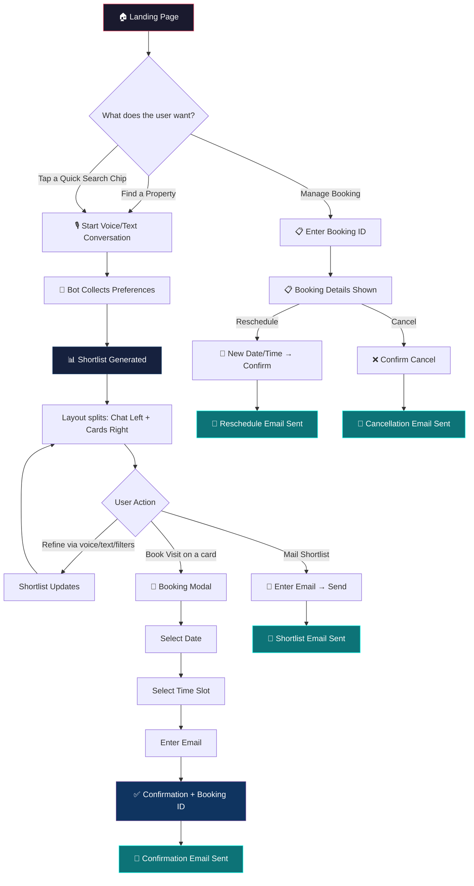

# The Property Scout — UX Design & User Flows

> This document defines every user persona, their journey, and the UI patterns that serve them. **No code will be written until this is approved.**

---

## 1. User Personas

### Persona 1: 🆕 First-Time Property Seeker ("Priya")
- **Who**: Someone new to Bengaluru (or moving within the city) looking for a rental.
- **Mindset**: Overwhelmed, doesn't know neighborhoods well, needs hand-holding.
- **Entry point**: Lands on the app for the first time.
- **Needs**: Guided preference collection, neighborhood education, clear shortlist with reasoning.

### Persona 2: 🔁 Returning Property Seeker ("Rahul")
- **Who**: Someone who visited before, maybe got a shortlist, but didn't book yet.
- **Mindset**: Knows what they want, wants to pick up where they left off or refine.
- **Entry point**: Returns to app, may or may not have a booking ID.
- **Needs**: Quick resume of previous conversation/preferences, ability to jump straight to refining.

### Persona 3: 📅 Booking Manager ("Sneha")
- **Who**: Someone who already booked a visit and wants to reschedule or cancel.
- **Mindset**: Task-focused. Doesn't want to go through property search again.
- **Entry point**: Returns with a Booking ID (e.g., `BK-A3F72K`).
- **Needs**: Fast lookup by booking ID, clear reschedule/cancel flow, instant confirmation.

### Persona 4: 📧 Shortlist Reviewer ("Amit")
- **Who**: Someone who received a shortlist email and is reviewing properties on their phone/laptop.
- **Mindset**: Comparing options, wants to drill into details, might want to book from here.
- **Entry point**: Clicks a link from the emailed shortlist (future scope), or returns to the app.
- **Needs**: Property cards with full details, easy "Book Visit" action from any card.

### Persona 5: 👥 Shared Decision Maker ("Deepa & Karthik")
- **Who**: A couple or roommates deciding together.
- **Mindset**: One person drives the conversation, both review the shortlist.
- **Entry point**: Same as Persona 1, but they want to email the shortlist to the other person.
- **Needs**: "Mail this shortlist" prominently available, clear property comparison.

---

## 2. Landing Experience & Entry Flows

When a user opens the app, they should see a **clean, welcoming landing state** — not an empty chat window.

### Landing Screen Layout

```
┌─────────────────────────────────────────────────────┐
│  🏠 The Property Scout                    [Dark Mode]│
├─────────────────────────────────────────────────────┤
│                                                     │
│         Welcome to The Property Scout 👋            │
│      Your AI-powered rental assistant for           │
│              Bengaluru                              │
│                                                     │
│  ┌─────────────────────────────────────────────┐    │
│  │                                             │    │
│  │         [ 🎙️ Start Voice Search ]           │    │
│  │                                             │    │
│  │    or type your requirements below...       │    │
│  │    ┌──────────────────────────────────┐     │    │
│  │    │ Type here...              [Send] │     │    │
│  │    └──────────────────────────────────┘     │    │
│  └─────────────────────────────────────────────┘    │
│                                                     │
│  ── Quick Actions ──────────────────────────────    │
│                                                     │
│  [ 🔍 Find a Property ]  [ 📅 Manage Booking ]     │
│                                                     │
│  ── Popular Searches ───────────────────────────    │
│                                                     │
│  [ 2BHK in Koramangala ]  [ Budget under 30k ]     │
│  [ Near Metro Station  ]  [ Pet-friendly flat ]    │
│                                                     │
└─────────────────────────────────────────────────────┘
```

### Quick Actions Explained

| Quick Action | What it does | Serves Persona |
|---|---|---|
| 🔍 **Find a Property** | Starts the voice/text conversation to collect preferences | Priya, Rahul |
| 📅 **Manage Booking** | Opens a modal asking for Booking ID (`BK-XXXXXX`) to view/reschedule/cancel | Sneha |

### Popular Searches (Suggestion Chips)
These are **pre-filled prompts** that the user can tap instead of typing. They immediately send that text to the bot:
- "2BHK in Koramangala under 40k"
- "Room in a flat near Whitefield"
- "Budget under 30k"
- "Pet-friendly flat in HSR Layout"

> [!TIP]
> These chips dramatically reduce friction for first-time users who don't know what to say. They also give returning users a fast path.

---

## 3. Conversation Flow & Layout Transition

### Phase 1: Full-Width Conversation (Collecting Preferences)

The conversation starts **centered and full-width**. The bot greets the user and begins collecting preferences through voice or text.

```
┌─────────────────────────────────────────────────────┐
│  🏠 The Property Scout                              │
├─────────────────────────────────────────────────────┤
│                                                     │
│  🤖 Hi! I'm your Property Scout. I'll help you     │
│     find the perfect rental in Bengaluru.           │
│     What are you looking for?                       │
│                                                     │
│  👤 I need a 2BHK in Koramangala, budget around     │
│     35 thousand                                     │
│                                                     │
│  🤖 Great choice! Let me search for 2BHK flats in  │
│     Koramangala under ₹35,000...                    │
│                                                     │
│  ┌──────────────────────────────────────────┐       │
│  │ Type or speak...           [🎙️] [Send]  │       │
│  └──────────────────────────────────────────┘       │
└─────────────────────────────────────────────────────┘
```

### Phase 2: Split-Pane (Shortlist Generated)

Once the bot generates a shortlist, the layout **smoothly animates** into a split-pane view:
- **Left pane (40%)**: Conversation continues
- **Right pane (60%)**: Property cards, filters, and actions

```
┌──────────────────────┬──────────────────────────────┐
│  Conversation        │  Your Shortlist (4 matches)  │
│                      │                              │
│  🤖 I found 4 great  │  ┌─── Filter Bar ─────────┐ │
│  matches for you!    │  │ Budget: ₹20k-₹35k       │ │
│                      │  │ BHK: [2] [3]            │ │
│  Each one is under   │  │ Area: Koramangala ✕     │ │
│  your 35k budget     │  └────────────────────────┘ │
│  in Koramangala.     │                              │
│                      │  ┌── Property Card 1 ─────┐ │
│  👤 What about        │  │ ₹32,000/mo · 2 BHK     │ │
│  parking?            │  │ 📍 5th Block, Koramang. │ │
│                      │  │ 🏪 Metro 500m · Gym 1km │ │
│  🤖 Let me check     │  │ ⭐ "Under budget, close  │ │
│  the amenities...    │  │    to metro"             │ │
│                      │  │ [📅 Book Visit] [📧 Mail]│ │
│                      │  └────────────────────────┘ │
│                      │                              │
│ ┌──────────────────┐ │  ┌── Property Card 2 ─────┐ │
│ │ Type...  [🎙️][↑] │ │  │ ₹28,000/mo · 2 BHK     │ │
│ └──────────────────┘ │  │ ...                      │ │
└──────────────────────┴──────────────────────────────┘
```

---

## 4. Property Card Design

Each property card must show **everything the user needs to decide**, without overwhelming them.

### Card Sections (Top to Bottom)

| Section | Content | Notes |
|---|---|---|
| **Header** | Rent (₹/mo), BHK, Accommodation Type (Whole Flat / Room) | Large, bold |
| **Address** | Full address + locality tag | Clickable to open in Google Maps |
| **Why This Match** | AI-generated reasoning grounded in user preferences | e.g., "Under your 35k budget, 10 min walk to Koramangala metro" |
| **Amenities Grid** | Icons + distances for nearby amenities | Grouped by category: 🏪 Daily, 🏥 Health, 🚇 Transport, 🌳 Recreation |
| **Neighborhood Insights** | Collapsible section with RAG-sourced info | Safety, vibe, noise, walkability — with source citations |
| **Sources** | Collapsible "References" section | Links to Reddit threads, blogs where neighborhood info came from |
| **Missing Data Badge** | "Data unavailable" pill for any missing field | Never fabricate, always be transparent |
| **Action Buttons** | `📅 Book Visit` and `📧 Mail to Self` | Always visible at the bottom of the card |

---

## 5. Booking Flow (Slot Selection)

When a user taps **"Book Visit"** on a property card (or says "I want to visit this property"), a **Booking Modal** slides up.

### Booking Modal Flow

```
Step 1: Select Date
┌────────────────────────────────────┐
│  📅 Book a Visit                   │
│  Property: 2BHK, 5th Block Kora.   │
│                                    │
│  Select a date:                    │
│  ┌──────────────────────────────┐  │
│  │      August 2026             │  │
│  │  Mo Tu We Th Fr Sa Su       │  │
│  │              1  2  3        │  │
│  │   4  5  6  7  8  9 10      │  │
│  │  11 12 13 14 [15] 16 17    │  │
│  │  18 19 20 21 22 23 24      │  │
│  └──────────────────────────────┘  │
│                                    │
│  Past dates are greyed out.        │
│                    [Next →]        │
└────────────────────────────────────┘

Step 2: Select Time Slot
┌────────────────────────────────────┐
│  📅 Book a Visit — Aug 15          │
│                                    │
│  Available Slots:                  │
│                                    │
│  [ 10:00 AM ] [ 11:00 AM ]        │
│  [ 12:00 PM ] [  2:00 PM ]        │
│  [  3:00 PM ] [  4:00 PM ]        │
│  [  5:00 PM ] [  6:00 PM ]        │
│                                    │
│  ❌ Unavailable (already booked):  │
│  [ 1:00 PM - Booked ]             │
│                                    │
│              [← Back] [Next →]     │
└────────────────────────────────────┘

Step 3: Enter Email
┌────────────────────────────────────┐
│  📅 Book a Visit — Aug 15, 3 PM    │
│                                    │
│  Your email (for confirmation):    │
│  ┌──────────────────────────────┐  │
│  │ priya@gmail.com              │  │
│  └──────────────────────────────┘  │
│                                    │
│  ✅ I'll receive a confirmation    │
│     email with my Booking ID.      │
│                                    │
│          [← Back] [Confirm Visit]  │
└────────────────────────────────────┘

Step 4: Confirmation
┌────────────────────────────────────┐
│  ✅ Visit Booked!                   │
│                                    │
│  📋 Your Booking ID: BK-A3F72K     │
│                                    │
│  📍 2BHK, 5th Block, Koramangala   │
│  📅 Aug 15, 2026 at 3:00 PM       │
│  📧 Confirmation sent to:          │
│     priya@gmail.com                │
│                                    │
│  ⚠️ Save your Booking ID!          │
│  You'll need it to reschedule      │
│  or cancel.                        │
│                                    │
│  [📋 Copy Booking ID]  [Done]      │
└────────────────────────────────────┘
```

> [!IMPORTANT]
> **Slot Selection UX**: The system queries the database for already-booked slots on the selected date and greys them out. The user can only pick available slots. This prevents the frustration of selecting a time only to be told "Sorry, that's taken."

---

## 6. Manage Booking Flow (Reschedule / Cancel)

When a user clicks **"Manage Booking"** from the landing page (or says "I want to reschedule my visit"):

### Booking Lookup Modal

```
┌────────────────────────────────────┐
│  📅 Manage Your Booking             │
│                                    │
│  Enter your Booking ID:           │
│  ┌──────────────────────────────┐  │
│  │ BK-                          │  │
│  └──────────────────────────────┘  │
│                                    │
│              [Look Up Booking]     │
└────────────────────────────────────┘
```

### Booking Details View

```
┌────────────────────────────────────┐
│  📋 Booking BK-A3F72K              │
│  Status: ✅ Confirmed              │
│                                    │
│  📍 2BHK, 5th Block, Koramangala   │
│  📅 Aug 15, 2026 at 3:00 PM       │
│  📧 priya@gmail.com                │
│                                    │
│  ┌──────────┐  ┌────────────────┐  │
│  │ Reschedule│  │ Cancel Visit   │  │
│  │    📅     │  │      ❌        │  │
│  └──────────┘  └────────────────┘  │
│                                    │
│  [← Back to Home]                  │
└────────────────────────────────────┘
```

- **Reschedule**: Opens the same Date → Time Slot → Confirm flow, but pre-fills the email. Sends a "Rescheduled" email.
- **Cancel**: Shows a confirmation dialog ("Are you sure?"), then cancels and sends a "Cancelled" email.

---

## 7. Email Touchpoints

| Trigger | How User Initiates | Email Subject | Email Contains |
|---|---|---|---|
| **Book Visit** | Taps "Book Visit" button OR says "I want to visit this property" | "✅ Visit Confirmed — BK-A3F72K" | Property details, date/time, booking ID, address with map link |
| **Reschedule** | Taps "Reschedule" in Manage Booking OR says "Reschedule my visit BK-A3F72K" | "📅 Visit Rescheduled — BK-A3F72K" | Old date/time → New date/time, property details, booking ID |
| **Cancel** | Taps "Cancel" in Manage Booking OR says "Cancel my visit BK-A3F72K" | "❌ Visit Cancelled — BK-A3F72K" | Cancelled confirmation, property details, booking ID |
| **Mail Shortlist** | Taps "📧 Mail Shortlist" button OR says "Send me this list on my email" | "🏠 Your Property Shortlist — The Property Scout" | All shortlisted property cards rendered as rich HTML |

### Email Collection Logic
- **For Booking/Reschedule/Cancel via Voice**: The bot will ask *"What email should I send the confirmation to?"* and wait for the user to speak or type their email.
- **For Mail Shortlist**: A small email input modal pops up with a text field.
- **Smart Memory**: Once a user provides their email in a session, it is stored in the session state. Any subsequent action (booking another property, mailing shortlist) **pre-fills** the email so they don't have to repeat it.

---

## 8. Additional UX Enhancements

### Quick Action Chips (During Conversation)
After the shortlist is generated, show **contextual quick action chips** above the text input:

```
[ Drop above 40k ] [ Show only near Metro ] [ Mail this list ] [ Book a visit ]
```

These give the user one-tap shortcuts instead of typing or speaking full sentences.

### Floating Property Count Badge
When in split-pane mode, show a small badge:
```
Your Shortlist (4 properties)
```
If filters reduce the count, it updates in real time: `(2 of 4 shown)`.

### Empty State & Error Handling
- **No matches found**: Show a friendly illustration + "No properties match your criteria. Try adjusting your budget or locality." with suggestion chips to broaden the search.
- **Network error**: "We're having trouble connecting. Your conversation is saved — try again in a moment."
- **Missing neighborhood data**: Show a `ℹ️ Neighborhood data not available for this area` badge instead of leaving it blank or making things up.

### Accessibility
- All buttons have `aria-labels`
- Keyboard navigation works for all modals
- Color contrast meets WCAG AA standards
- Screen reader support for property cards

### Mobile Responsive
- On mobile, the split-pane becomes a **tabbed view**: Tab 1 = Conversation, Tab 2 = Shortlist
- Booking modal becomes full-screen on mobile
- Voice button is prominently placed at the bottom center

---

## 9. Complete User Journey Map



---

## 10. Open Questions for You

> [!IMPORTANT]
> **Q1**: Should the "Manage Booking" flow be available **only** from the landing page quick action, or should there also be a way to manage bookings from inside the conversation? (e.g., user says "Check my booking BK-A3F72K" mid-conversation)

> [!IMPORTANT]
> **Q2**: For the shortlist email, should it include **all** properties currently visible (after filters), or only the ones the user explicitly marked/starred?

> [!IMPORTANT]
> **Q3**: Do you want a "Compare Properties" feature where the user can select 2-3 cards and see them side-by-side in a comparison table?

> [!IMPORTANT]  
> **Q4**: Should we show a "Recently Viewed" section on the landing page for returning users, or keep it clean with just the two quick actions?

---

*This document will be the blueprint for every UI component we build. Nothing gets coded until you approve this.*
